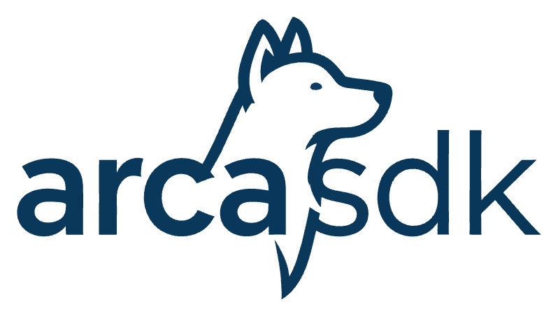

# Arca SDK


[](https://npmjs.org/package/@arcasdk/core)


<br />
<p align="center">
  <a href="https://github.com/ralcorta/arcasdk">
    
  </a>

  <p align="center">
    SDK para consumir y usar los Web Services de ARCA (ex AFIP)
    <br />
    <a href="https://ralcorta.github.io/arcasdk">Ver documentacion completa</a>
    <br />
    <br />
    <small> 
        Inspirado en <a href="https://github.com/AfipSDK/afip.js">afip.js</a> 
      <br />
      <a href="https://github.com/ralcorta/arcasdk/issues">Reportar un bug</a>
    </small>
  </p>
</p>

<br />
<p align="center">
<a href='https://cafecito.app/rodrigoalcorta' rel='noopener' target='_blank'></a>
</p>

---

> ### ⚠️ AVISO DE MIGRACIÓN
>
> **Este proyecto ha evolucionado de `afip.ts` a Arca SDK.**
>
> El repositorio ha sido renombrado y el paquete ahora se publica como [`@arcasdk/core`](https://www.npmjs.com/package/@arcasdk/core).
>
> **¿Cómo seguir usando la versión anterior?**
> El código original de `afip.ts` se encuentra preservado en la rama [`afip.ts`](../../tree/afip.ts) y el paquete sigue disponible en npm como [`afip.ts`](https://www.npmjs.com/package/afip.ts).
>
> Todo el desarrollo futuro continuará en la rama `main` bajo el nuevo nombre.

## Paquetes

| Paquete                          | Descripción                                                           |                                                                                                                     |
| :------------------------------- | :-------------------------------------------------------------------- | :-----------------------------------------------------------------------------------------------------------------: |
| [`@arcasdk/core`](packages/core) | SDK para Web Services de ARCA: facturación electrónica, padrones, FCE | [](https://npmjs.org/package/@arcasdk/core) |
| [`@arcasdk/pdf`](packages/pdf)   | Generador de PDFs para comprobantes electrónicos (A, B, C, E, M)      |  [](https://npmjs.org/package/@arcasdk/pdf)  |

---

## Instalación

```sh
# Core (Web Services)
npm i @arcasdk/core

# PDF (generador de comprobantes)
npm i @arcasdk/pdf
```

## Uso rápido

### Facturación electrónica

```ts
import { Arca } from "@arcasdk/core";

const arca: Arca = new Arca({
  key: "private_key_content",
  cert: "crt_content",
  cuit: 20111111112,
});

const date = new Date(Date.now() - new Date().getTimezoneOffset() * 60000).toISOString().split("T")[0];

const payload = {
  CantReg: 1, // Cantidad de comprobantes a registrar
  PtoVta: 1, // Punto de venta
  CbteTipo: 6, // Tipo de comprobante (ver tipos disponibles)
  Concepto: 1, // Concepto del Comprobante: (1)Productos, (2)Servicios, (3)Productos y Servicios
  DocTipo: 99, // Tipo de documento del comprador (99 consumidor final, ver tipos disponibles)
  DocNro: 0, // Número de documento del comprador (0 consumidor final)
  CbteDesde: 1, // Número de comprobante o numero del primer comprobante en caso de ser mas de uno
  CbteHasta: 1, // Número de comprobante o numero del último comprobante en caso de ser mas de uno
  CbteFch: date.replace(/-/g, ""), // (Opcional) Fecha del comprobante (yyyymmdd) o fecha actual si es nulo
  ImpTotal: 121, // Importe total del comprobante
  ImpTotConc: 0, // Importe neto no gravado
  ImpNeto: 100, // Importe neto gravado
  ImpOpEx: 0, // Importe exento de IVA
  ImpIVA: 21, //Importe total de IVA
  ImpTrib: 0, //Importe total de tributos
  MonId: "PES", //Tipo de moneda usada en el comprobante (ver tipos disponibles)('PES' para pesos argentinos)
  MonCotiz: 1, // Cotización de la moneda usada (1 para pesos argentinos)
  CondicionIVAReceptorId: 1, // Condición de IVA del receptor
  Iva: [
    // (Opcional) Alícuotas asociadas al comprobante
    {
      Id: 5, // Id del tipo de IVA (5 para 21%)(ver tipos disponibles)
      BaseImp: 100, // Base imponible
      Importe: 21, // Importe
    },
  ],
};

const invoice = await arca.electronicBillingService.createInvoice(payload);
```

### Generar PDF

```ts
import { InvoicePdfGenerator } from "@arcasdk/pdf";

const generator = new InvoicePdfGenerator();
const pdfBuffer = await generator.generate(invoiceData);
```

> Ver la [documentación de `@arcasdk/pdf`](https://ralcorta.github.io/arcasdk/packages/pdf) para más detalles.

## Características

- 100% **TypeScript**
- Soporte **Serverless** — manejo aislado de tokens de autenticación
- Múltiples [engines SOAP](https://ralcorta.github.io/arcasdk/soap-engines) (Node.js, Universal, custom)

## Requisitos

Certificados emitidos por ARCA para homologación o producción:

- [Guía de obtención](https://ralcorta.github.io/arcasdk/tutorial/enable_testing_certificates.html)
- [Documentación oficial](https://www.afip.gob.ar/ws/documentacion/certificados.asp)

Para más documentación, ir al [sitio oficial](https://ralcorta.github.io/arcasdk).

## Desarrollo y Contribuciones

### Contribuciones

Nos encantaría que contribuyas a mejorar `arcasdk`. Para una guía completa de desarrollo, ver [CONTRIBUTING.md](CONTRIBUTING.md) que incluye:

## Licencia

Este proyecto esta bajo la licencia `MIT` - Ver [LICENSE](LICENSE) para mas detalles.

<small>
Este software y sus desarrolladores no tienen ninguna relación con la ARCA/AFIP.
</small>
