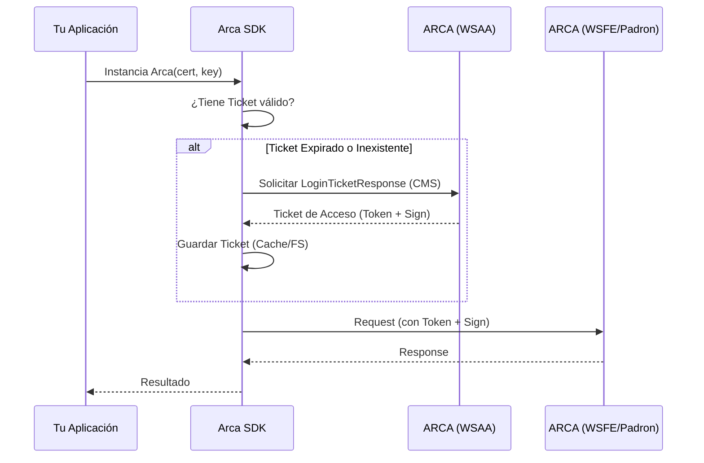

# ☁️ Gestión de Credenciales

### Gestión de credenciales

Por defecto, el paquete guardará automáticamente las credenciales recibidas del Web Service de ARCA al iniciar sesión. Estas credenciales se almacenan para su posterior uso en las request que las requieran. Esta práctica se debe a que el servicio de autenticación de ARCA (WSAA) limita la generación de credenciales para un usuario en intervalos de tiempo específicos, como se explica en la sección de [comportamientos](./behaviour).

Sin embargo, si estás trabajando en un entorno que no puede administrar el espacio de memoria de manera prolongada para almacenar estas credenciales, debes encargarte de su gestión de forma manual. Para ello, debes especificarle a la instancia que lo manejarás por tu cuenta, agregando al contexto dado en el momento de la instancia de Arca el flag `handleTicket` en `true`.

Necesitarás obtener las credenciales manualmente usando `AuthRepository` y guardarlas de manera segura (base de datos, S3, etc.). Estas credenciales deben proporcionarse a la instancia de Arca a través del constructor usando el campo `credentials` del contexto.

Una vez que las credenciales se han configurado correctamente, puedes ejecutar cualquier método desde tu servicio de ARCA. El paquete automáticamente adjuntará las credenciales necesarias a la solicitud correspondiente.

### Flujo de Autenticación



#### Ejemplo

```ts:line-numbers
import { Arca, AuthRepository, ServiceNamesEnum, AccessTicket } from "@arcasdk/core";
import * as fs from "fs";
import * as path from "path";

// Ejemplo: Obtener credenciales guardadas previamente
const ticketPath = path.join(__dirname, "tickets", "TA-20111111112-wsfe.json");

let ticket: AccessTicket | null = null;

// Cargar ticket existente si existe y no está expirado
if (fs.existsSync(ticketPath)) {
  const ticketData = JSON.parse(fs.readFileSync(ticketPath, "utf8"));
  ticket = AccessTicket.create(ticketData);

  if (ticket.isExpired()) {
    ticket = null; // El ticket expiró, necesitamos uno nuevo
  }
}

// Si no hay ticket válido, obtener uno nuevo
if (!ticket) {
  const authRepository = new AuthRepository({
    cert: "contenido_del_certificado",
    key: "contenido_de_la_clave_privada",
    cuit: 20111111112,
    production: false,
    handleTicket: false,
  });

  ticket = await authRepository.login(ServiceNamesEnum.WSFE);

  // Guardar el ticket en tu almacenamiento preferido
  const ticketDir = path.dirname(ticketPath);
  if (!fs.existsSync(ticketDir)) {
    fs.mkdirSync(ticketDir, { recursive: true });
  }
  fs.writeFileSync(
    ticketPath,
    JSON.stringify(ticket.toLoginCredentials(), null, 2),
    "utf8"
  );
}

// Crear instancia de Arca con las credenciales ya obtenidas
const arca: Arca = new Arca({
  key: "contenido_de_la_clave_privada",
  cert: "contenido_del_certificado",
  cuit: 20111111112,
  handleTicket: true,
  credentials: ticket.toLoginCredentials(), // Pasar las credenciales obtenidas
});

// Facturamos normalmente
const factura = await arca.electronicBillingService.createVoucher({
  // datos de la factura
});
```
