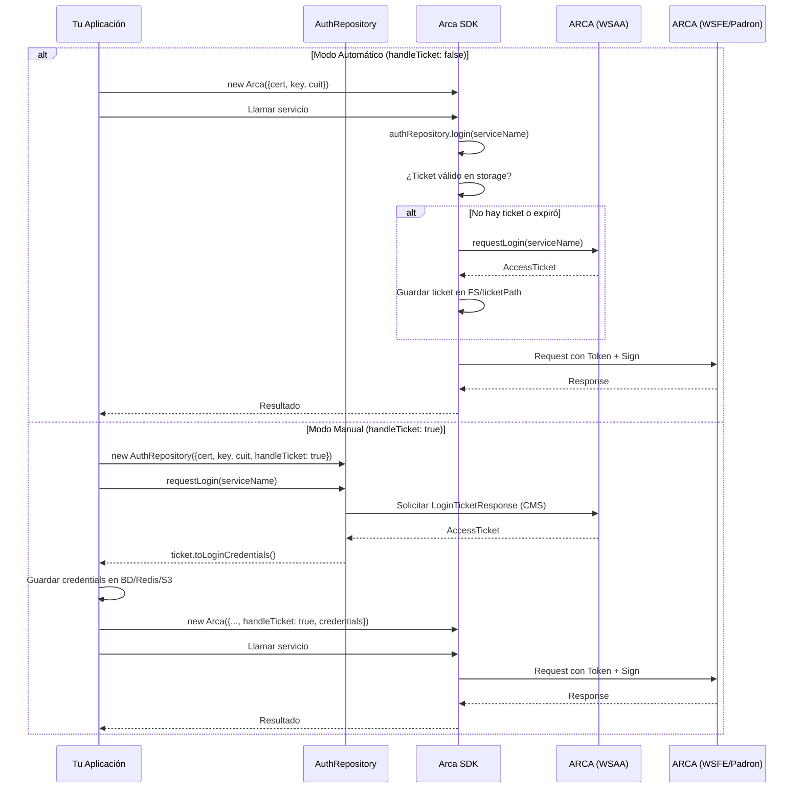

# Gestión de Credenciales

---

## Introducción

Cuando usas la SDK, necesitas **autenticarte con ARCA (WSAA)** para obtener un token de acceso. Este token es válido por 12 horas y tiene restricciones de solicitud (máximo 1 cada 2 minutos en producción).

La SDK ofrece tres estrategias para gestionar estos tokens:

1. **Automática en disco (por defecto):** La SDK se encarga de todo y persiste en filesystem (Node.js)
2. **Manual con `credentials`:** Tú guardás y pasás `ILoginCredentials` en cada instancia de `Arca`
3. **Almacenamiento personalizado (`ticketStorage`):** Implementás `ITicketStoragePort` (Redis, BD, etc.) y la SDK reutiliza tickets sin filesystem local

---

## Opción 1: Automática (Recomendado)

La SDK genera, almacena y reutiliza tokens automáticamente. No necesitas hacer nada especial.

```ts
import { Arca } from "@arcasdk/core";

const arca = new Arca({
  cuit: 20111111112,
  cert: "contenido_del_certificado",
  key: "contenido_de_la_clave_privada",
  production: false,
  // Automáticamente:
  // 1. Obtiene token de WSAA
  // 2. Lo almacena en disco (por defecto dentro de node_modules/@arcasdk/core/lib/...)
  // 3. Lo reutiliza durante 12 horas
});

// Usar normalmente - el token se maneja internamente
const result = await arca.registerScopeFourService.getTaxpayerDetails(20111111111);
```

**Para personalizar ubicación de almacenamiento:**

```ts
const arca = new Arca({
  cuit: 20111111112,
  cert: "...",
  key: "...",
  ticketPath: "/var/lib/mi-app/arca/tickets", // Ruta absoluta en tu servidor
});
```

---

## Opción 3: Almacenamiento personalizado (`ticketStorage`)

Ideal para **serverless** o cuando querés centralizar tickets en Redis, PostgreSQL, S3, etc., **sin** pasar `credentials` manualmente en cada request.

Implementá la interfaz `ITicketStoragePort` o usá `MemoryTicketStorage` en procesos de corta vida (tests, scripts):

```ts
import {
  Arca,
  MemoryTicketStorage,
  FileSystemTicketStorage,
  type ITicketStoragePort,
} from "@arcasdk/core";

// Ejemplo: memoria (útil en tests; no persiste entre invocaciones Lambda)
const ticketStorage: ITicketStoragePort = new MemoryTicketStorage({
  cuit: 20111111112,
  production: false,
});

// Ejemplo: filesystem en ruta controlada por vos
const ticketStorageFs = new FileSystemTicketStorage({
  ticketPath: "/tmp/arca-tickets",
  cuit: 20111111112,
  production: false,
});

const arca = new Arca({
  cuit: 20111111112,
  cert: "...",
  key: "...",
  ticketStorage: ticketStorageFs,
});
```

La interfaz expone tres métodos:

```ts
interface ITicketStoragePort {
  save(ticket: AccessTicket, serviceName: ArcaServiceName): Promise<void>;
  get(serviceName: ArcaServiceName): Promise<AccessTicket | null>;
  delete(serviceName: ArcaServiceName): Promise<void>;
}
```

Para Redis o una base de datos, creá una clase que implemente estos métodos y pasala en `ticketStorage`. La SDK seguirá renovando tickets automáticamente cuando expiren.

::: tip Diferencia con modo manual
Con `ticketStorage` no necesitás `handleTicket: true` ni pasar `credentials` en cada `new Arca()`. La SDK lee y escribe tickets a través de tu adapter.
:::

---

## Opción 2: Manual (Para Serverless)

Usar cuando necesites control total sobre dónde guardar tokens (base de datos, Redis, S3, etc.).

**¿Por qué?** En entornos serverless (AWS Lambda, Vercel, etc.), el sistema de archivos es efímero, por lo que guardar tokens localmente no funciona.

### Paso 1: Entender la estructura de credenciales

Las credenciales son un objeto `ILoginCredentials` con esta estructura:

```ts
interface ILoginCredentials {
  header: {
    // Información de autenticación
  };
  credentials: {
    // Token y firma
  };
}
```

Este objeto se obtiene desde un `AccessTicket` llamando al método `toLoginCredentials()`. Se define en la documentación de configuración como:

> Un objeto de tipo `ILoginCredentials` que contiene las credenciales de autenticación si ya se tienen guardadas. Este objeto debe tener la estructura `{ header: {...}, credentials: {...} }` obtenida de un `AccessTicket` mediante el método `toLoginCredentials()`.

### Paso 2: Generar credenciales con AuthRepository

En modo manual, el flujo correcto es:

1. Crear `AuthRepository`
2. Solicitar ticket con `requestLogin(serviceName)`
3. Convertir el ticket a `ILoginCredentials` con `toLoginCredentials()`
4. Guardar esas credenciales en tu storage

```ts
import { AuthRepository, ArcaServiceNames } from "@arcasdk/core";

const authRepository = new AuthRepository({
  cuit: 20111111112,
  cert: "contenido_del_certificado",
  key: "contenido_de_la_clave_privada",
  production: false,
  handleTicket: true,
});

const ticket = await authRepository.requestLogin(ArcaServiceNames.WSFE);
const credentials = ticket.toLoginCredentials();
```

### Paso 3: Guardar las credenciales

Después de obtener `credentials`, debes:

1. Acceder a las credenciales internas (varía según tu implementación)
2. Guardarlas en tu BD/S3/Redis con su timestamp
3. Reutilizarlas en próximas llamadas dentro del período de validez (12 horas)

**Ejemplo con base de datos:**

```ts
// Guardar después del primer uso
async function saveCredentials(cuit: number, credentials: ILoginCredentials) {
  const expiresAt = new Date(credentials.header[1].expirationtime);

  await database.credentialCache.upsert({
    cuit,
    credentials: JSON.stringify(credentials),
    expiresAt, // Usar expiración real enviada por WSAA
  });
}

// Recuperar para uso posterior
async function getCredentials(cuit: number) {
  const record = await database.credentialCache.findOne({ cuit });

  if (!record) return null;

  // Verificar que no haya expirado
  if (new Date() > new Date(record.expiresAt)) {
    await database.credentialCache.delete({ cuit });
    return null;
  }

  return JSON.parse(record.credentials);
}
```

### Paso 4: Reutilizar credenciales al crear Arca

En tu próxima función/request, pasa las credenciales guardadas:

```ts
// Obtener credenciales guardadas
const savedCredentials = await getCredentials(20111111112);

const arca = new Arca({
  cuit: 20111111112,
  cert: "contenido_del_certificado",
  key: "contenido_de_la_clave_privada",
  production: false,
  handleTicket: true,
  credentials: savedCredentials, // Reutilizar token existente
});

// Usar servicio con token ya cargado en credentials
const result = await arca.electronicBillingService.createVoucher({
  CantReg: 1,
  PtoVta: 1,
  CbteTipo: 6,
  // ... resto de parámetros
});
```

### Paso 5: Detectar expiración y renovar

Si el token expiró (12 horas), debes generar uno nuevo con `AuthRepository` y volver a guardar:

```ts
async function ensureValidCredentials(cuit: number) {
  let credentials = await getCredentials(cuit);

  // Si no hay o expiró, generar nuevo
  if (!credentials) {
    const authRepository = new AuthRepository({
      cuit,
      cert: "...",
      key: "...",
      production: false,
      handleTicket: true,
    });

    const ticket = await authRepository.requestLogin(ArcaServiceNames.WSFE);
    credentials = ticket.toLoginCredentials();
    await saveCredentials(cuit, credentials);
  }

  return credentials;
}
```

---

## Parámetro `credentials` (Referencia)

La configuración completa según [config.md](./config):

```ts
const arca = new Arca({
  cuit: 20111111112,
  cert: "...",
  key: "...",
  credentials: {
    // Tipo: ILoginCredentials
    header: {
      // Información de autenticación
    },
    credentials: {
      // Token y firma
    },
  },
  handleTicket: true, // Necesario cuando usas credentials
});
```

**Nota:** Este parámetro:

- Solo se usa en modo manual (`handleTicket: true`)
- Contiene un token ya generado previamente
- Es opcional - si no lo pasas, SDK genera uno nuevo en la primera llamada
- Es válido por 12 horas desde su generación
- Se obtiene con `AuthRepository.requestLogin(...).toLoginCredentials()`

---

## Flujo de Autenticación


```mermaid
sequenceDiagram
  participant App as Tu Aplicación
  participant Auth as AuthRepository
  participant Arca as Arca SDK
  participant WSAA as ARCA (WSAA)
  participant Service as ARCA (WSFE/Padron)

  alt Modo Automático (handleTicket: false)
    App->>Arca: new Arca({cert, key, cuit})
    App->>Arca: Llamar servicio
    Arca->>Arca: authRepository.login(serviceName)
    Arca->>Arca: ¿Ticket válido en storage?
    alt No hay ticket o expiró
      Arca->>WSAA: requestLogin(serviceName)
      WSAA-->>Arca: AccessTicket
      Arca->>Arca: Guardar ticket en FS/ticketPath
    end
    Arca->>Service: Request con Token + Sign
    Service-->>Arca: Response
    Arca-->>App: Resultado
  else Modo Manual (handleTicket: true)
    App->>Auth: new AuthRepository({cert, key, cuit, handleTicket: true})
    App->>Auth: requestLogin(serviceName)
    Auth->>WSAA: Solicitar LoginTicketResponse (CMS)
    WSAA-->>Auth: AccessTicket
    Auth-->>App: ticket.toLoginCredentials()
    App->>App: Guardar credentials en BD/Redis/S3
    App->>Arca: new Arca({..., handleTicket: true, credentials})
    App->>Arca: Llamar servicio
    Arca->>Service: Request con Token + Sign
    Service-->>Arca: Response
    Arca-->>App: Resultado
  end
```

---

## Comparativa Rápida

| Aspecto                  | Automático (disco) | `ticketStorage` custom | Manual (`credentials`) |
| ------------------------ | ------------------ | ---------------------- | ---------------------- |
| **Configuración**        | Simple             | Implementar adapter    | Requiere setup         |
| **Almacenamiento**       | FS local           | Tu elección            | Tu elección            |
| **Renovación de tokens** | Automática         | Automática             | Manual                 |
| **Uso en serverless**    | No                 | Sí                     | Sí                     |
| **Flexibilidad**         | Baja               | Alta                   | Alta                   |

**Cuándo usar cada uno:**

| Escenario                                | Usar                              |
| ---------------------------------------- | --------------------------------- |
| Servidor tradicional, desarrollo local   | **Automático** (`ticketPath`)     |
| AWS Lambda, Vercel, Cloudflare Workers   | **`ticketStorage`** o **Manual**  |
| Necesitas persistencia en Redis/BD       | **`ticketStorage`**               |
| Múltiples instancias compartiendo tokens | **`ticketStorage`** o **Manual**  |
| Quieres la solución más simple           | **Automático**                    |

---

## Preguntas Frecuentes

**¿Los tokens son seguros?**
Sí, son tokens de corta vida (12 horas) y están firmados criptográficamente por ARCA. Están protegidos en tránsito y en almacenamiento.

**¿Puedo guardar tokens en base de datos?**
Sí, usando modo manual (`handleTicket: true`) puedes guardar/recuperar de cualquier lugar (BD, Redis, S3, etc.). Solo asegúrate de:

- Guardarlos de forma segura (cifrados)
- Validar que no hayan expirado antes de usarlos
- Tener un mecanismo para generar nuevos si expiran

**¿Qué pasa si el token expira?**

- En modo automático, la SDK genera uno nuevo automáticamente
- En modo manual, tu código debe detectar la expiración (12 horas) y generar uno nuevo

**¿Hay un ejemplo completo?**
Sí, en esta misma guía (sección "Opción 2: Manual") tienes el flujo completo para serverless.

**¿Cómo extraigo las credenciales después del primer uso?**
Esto depende de tu implementación. Consulta cómo accedes a las credenciales internas en tu versión de la SDK. Generalmente se usa el método `toLoginCredentials()` en un `AccessTicket`.
